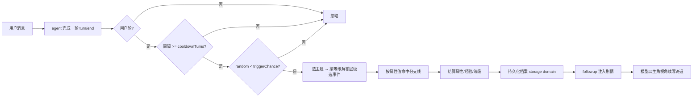
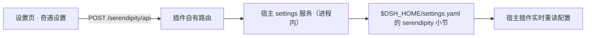

# 工作奇遇（@pocket30/dsh-serendipity）

一个 DeepSeek Harness（dsh）插件：把**用户本人当作主角**来养成。

每次你完成一轮对话，插件都有一定概率触发一次**随机奇遇**。奇遇来自不同主题
（科幻、玄幻、远古、动漫、小说、武侠、都市…），每个主题下都有大量事件，
每个事件会对主角的**力量 / 智力 / 敏捷 / 魅力 / 幸运 / 体魄**等属性产生
不同程度的影响（有增益、有代价、有权衡），并积累经验、升级等级。

- **等级解锁宏大事件**：事件按层级划分（日常 → 冒险 → 史诗 → 传奇），
  等级越高，越能解锁并更常遇到更宏大的奇遇。
- **属性分支线**：带分支的事件会根据你当前的属性值走向不同的剧情线
  （力量流 / 智力流 / 魅力流……），同样的奇遇在不同角色身上会有不同的结局。

属性会持久化，跨会话、跨重启持续养成，并反过来影响你与模型的后续对话走向。

插件还会在 dsh 设置页注册一个**“奇遇设置”页**（参照 DSH-better-sidebar 的
“侧边卡片”交互）：通用参数开关行 + 主题小卡片网格（点击即开关，齿轮弹窗调
二级设置），修改即时生效（写回 `$DSH_HOME/settings.yaml` 的 `serendipity:` 小节）。

---

## 功能一览

- 对话结束自动触发：监听 `turn/end`，只统计**由你发起**的对话轮，插件自己
  注入的剧情轮不会重复触发（不会无限套娃）。
- 概率与冷却：触发概率、两次奇遇之间的最小用户对话轮数均可配置。
- 主题 + 事件库：内置 7 大主题、50+ 事件，支持追加事件/主题、禁用主题；
  题材**单选**（设置页点选一个题材后，奇遇只在该题材内触发，不再跨题材跳转）。
- 等级解锁：事件分 **日常 / 冒险 / 史诗 / 传奇** 四个层级，达到对应等级后
  自动解锁；等级越高，抽中更宏大事件的概率越大（层级越高、经验与收益越大）。
- 属性分支线：带 `branches` 的事件会按主角**当前属性值**命中不同分支
  （如力量最高走「以力破局」、智力最高走「以智取胜」），分支各有专属的
  标题、剧情与属性结算。
- 属性养成：属性增减带区间夹取（0~100），经验积累自动升级。
- 剧情注入：默认 `followup` 模式，触发后让模型以主角视角把奇遇续写成故事，
  并在对话中交代属性变化。
- 状态可见：设置页「角色档案」分组直接展示等级/经验/六维属性/最近奇遇（可手动刷新）；
  模型也可通过 `serendipity_status` / `serendipity_reset` 工具查看/重置角色档案。
- 设置页可视化配置：dsh 设置 → “奇遇设置”，编辑后实时生效。
- 跨会话持久化：优先使用 storage domain（web 组合自带），重启后角色不丢；
  无 storage 的组合自动降级为进程内内存并告警。

## 演示效果

> 📸 **此区域预留给你（仓库作者）补充演示**：对话实录、设置页截图、等级成长
> 曲线、史诗/传奇奇遇的触发片段、不同属性分支线的对比等，都可以贴在这里。
> 下方是建议的占位结构，可直接替换内容。

### 触发示例（对话实录）

一次真实的奇遇触发（0.5.1；0.6.0 起头部会带层级标记，如「日常奇遇触发」）：

> 【工作奇遇】奇遇触发 · 玄幻
> 灵狐引路：深山古道上，一只通体雪白的灵狐在云雾缭绕的破庙前驻足回望，似乎想引你进入一处尘封已久的秘境。
> 属性变化：幸运 +5 · 智力 +2 · 经验 +12
> 当前状态：等级 1 · 经验 12/20 · 力量 10 · 智力 12 · 敏捷 10 · 魅力 10 · 幸运 15 · 体魄 10
> 累计奇遇：1 次

（待补充：更多实录，以及模型以主角视角续写的剧情。）

### 等级解锁（日常 → 冒险 → 史诗 → 传奇）

（待补充：低等级与高等级时抽到事件的区别，可贴两张 `serendipity_status` 截图。）

### 属性分支线（力量流 / 智力流 / 魅力流）

（待补充：同一事件在不同属性角色身上的不同结局对比。）

---

## 安装

### 环境要求

- dsh CLI **0.1.0-rc.6**（或与之兼容的版本，见下方「已知限制」）。
- 推荐 profile：`web`（自带 storage domain 与设置页容器）。

### 方式一：npm 包（推荐，含设置页卡片）

```sh
npx @deepseek-ai/dsh plugin --profile web add @pocket30/dsh-serendipity@0.6.0
```

> 如果你的 profile 不是 `web`，把命令里的 `web` 换成你的 profile 名即可。

### 安装后

1. **重启 dsh web**：杀掉监听 3080 的进程，重新执行 `dsh web`，浏览器硬刷新。
2. 打开 dsh 设置页，导航里应出现 **“奇遇设置”** 页。
3. 完成几轮对话触发第一次奇遇后，「角色档案」会展示等级/属性/最近奇遇；
   模型也可调用 `serendipity_status` 查看养成状态。

### 卸载

```sh
dsh plugin --profile web remove @pocket30/dsh-serendipity
```

## 奇遇设置（设置页）

安装后打开 dsh 设置页，导航里会出现 **“奇遇设置”** 页（参照 DSH-better-sidebar
的“侧边卡片”交互）：

- **角色档案** 分组：主角的等级、经验进度、六维属性条与最近奇遇记录（新→旧，
  含层级标记如「史诗·科幻」），右上角「刷新」按钮重新拉取（奇遇在对话中触发，
  页面不会自动刷新）。
- **通用** 分组：逐项开关/输入行 —— 开启奇遇（总开关）、触发概率（百分比）、
  冷却轮数、剧情模式、档案 ID、角色名、奇遇记录条数。
- **主题** 分组：每个主题一张小卡片（科幻 🚀 / 玄幻 🐉 / 远古 🏺 / 动漫 ⭐ /
  小说 📖 / 武侠 ⚔️ / 都市 🏙️ 等），**单选**——点击卡片即选定该题材，其余题材
  自动关闭（避免多题材间跳转、破坏沉浸感）。末尾预留一张「自定义题材」占位卡片
  （敬请期待，后续经 `extraThemes` / `extraEvents` 配置添加）。

所有修改乐观更新并即时写入用户设置层（`$DSH_HOME/settings.yaml` 的
`serendipity:` 小节），带修订号守卫；失败自动回滚并内联报错。

> 实现说明：dsh 官方设置 RPC 只把白名单命名空间暴露给浏览器，第三方命名
> 空间不会下发。因此本插件的设置页走**插件自有路由**（`/serendipity/api`，
> 带与 /api 一致的信任围栏），宿主在进程内调用 settings 服务读写。
> 「角色档案」分组同样走该自有路由（`profile.get`），宿主从 storage domain
> 读取档案后返回等级/属性/最近奇遇视图。

> 主题事件目录（`extraThemes` / `extraEvents`）属于编排级配置，仍在
> `cordis.patch.yml` 的 `config` 里维护，见下文。

## 配置项

在 profile 的 `cordis.patch.yml` 里按行覆盖：

```yaml
- insert:
    - id: serendipity
      name: '@pocket30/dsh-serendipity'
      config:
        enabled: true            # 奇遇总开关
        triggerChance: 0.25      # 每次完成一轮用户对话的触发概率（0~1）
        cooldownTurns: 3         # 两次奇遇之间最少间隔的用户对话轮数（>=1）
        narrateMode: followup    # followup | inject | none
        theme: ''                # 单选主题：非空时只从该主题抽事件（'' = 按 disabledThemes 多选）
        profileId: default       # 档案 id，不同 id = 不同角色
        characterName: 无名主角  # 新角色的默认名字
        enableTools: true        # 是否注册 serendipity_* 工具（组合层配置）
        maxAdventureLog: 20      # 档案中保留的奇遇记录条数
```

设置页可改的字段会覆盖入口配置（设置层 > 组合层 > schema 默认值）。

### 自定义主题 / 事件示例

```yaml
config:
  extraThemes:
    detective:
      name: 侦探
      description: 谜案、线索与推理。
      events:
        - id: locked-room
          title: 密室谜案
          description: 一桩看似不可能的密室案件摆在你面前，唯一的钥匙孔上留着淡淡的蜡痕。
          effects:
            intelligence: 6
            luck: -1
          exp: 15
          minLevel: 2           # 可选：最低等级（也决定事件层级）
          branches:             # 可选：属性分支线
            - id: sharp-mind
              title: 一眼看破
              description: 你凭着过人的洞察力，一眼看出密室钥匙孔上的蜡痕是伪装。
              effects:
                intelligence: 8
              exp: 18
              when:
                attribute: intelligence
                min: 50
            - id: silver-tongue
              title: 巧舌如簧
              description: 你与唯一的嫌疑人周旋，三言两语便让他自己露出了马脚。
              effects:
                charisma: 7
                luck: 2
              exp: 18
              when:
                attribute: charisma
                highest: true
            - id: stroke-of-luck
              title: 灵光一现
              description: 你毫无头绪，却在整理证物时无意中碰倒了书架，滚出一封关键的信。
              effects:
                luck: 5
                intelligence: 3
              exp: 16
              when:
                always: true
  extraEvents:
    xianxia:
      - id: my-custom-event
        title: 自定义事件
        description: 你自己的奇遇。
        effects:
          strength: 3
        exp: 10
  disabledThemes:
    - urban
```

事件字段：`id`、`title`、`description`、`effects`（属性 id → 增减值）、
`exp`（经验）、`minLevel`（可选，最低等级，兼作层级门槛）。
属性 id：`strength` / `intelligence` / `agility` / `charisma` / `luck` / `vitality`。

事件层级（由 `minLevel` 决定，无需单独配置）：

| 层级   | minLevel | 解锁条件             |
| ------ | -------- | -------------------- |
| 日常   | 1        | 初始可用             |
| 冒险   | 2        | 2 级解锁             |
| 史诗   | 4        | 4 级解锁             |
| 传奇   | 7        | 7 级解锁             |

分支条件（`when`）支持五种写法，按声明顺序匹配第一条命中：

- `{ attribute, min }`：该属性 ≥ min 时命中；
- `{ attribute, max }`：该属性 ≤ max 时命中；
- `{ attribute, highest: true }`：该属性为六维最高（并列也算）时命中；
- `{ attribute, lowest: true }`：该属性为六维最低（并列也算）时命中；
- `{ always: true }`：无条件兜底，建议放在最后。

分支字段：`id`、`title`、`description`、`effects`、`exp`（可选，缺省用事件
`exp`）、`when`（命中条件）。未命中任何分支时按事件本体的标题/描述/属性结算。

## 模型可用工具

- `serendipity_status`：查看角色档案（等级、经验、六维属性、最近奇遇，含层级标记）。
- `serendipity_reset(confirm: true, name?)`：开启一份全新角色档案（需显式确认）。

## 工作原理



触发判定完全由**会话日志推导**（`source.kind === 'user'` 的轮次才算用户轮，
插件注入轮次的 `source.kind === 'plugin'` 不算），因此不会自我循环触发。

选事件的层级偏置：事件按 `minLevel` 分四档，未达等级门槛的事件不会入选；
解锁后抽中概率随等级线性提升（层级越高、上限越高），因此**等级越高，
越容易遇到更宏大的奇遇**。

设置链路：



## 目录结构

```text
@pocket30/dsh-serendipity/
├── src/
│   ├── index.ts         # 宿主插件入口：name / Config / apply
│   ├── config.ts        # 配置 schema + 主题目录合并
│   ├── attributes.ts    # 属性目录（六维）
│   ├── themes.ts        # 内置主题、事件库、层级与分支定义
│   ├── engine.ts        # 抽奖/层级偏置/分支命中/结算/升级（纯函数）
│   ├── profile.ts       # 角色档案模型（zod schema）
│   ├── store.ts         # 持久化：storage domain + 内存降级
│   ├── settings.ts      # 设置命名空间注册（serendipity）+ 读写面
│   ├── routes.ts        # /serendipity/api 路由 + 信任围栏
│   ├── runtime.ts       # turn/end 监听、触发判定、剧情注入
│   ├── tools.ts         # serendipity_status / serendipity_reset
│   └── client/          # 浏览器端：奇遇设置页
│       ├── index.ts     #   浏览器插件入口（slots + 注册设置页）
│       ├── api.ts       #   自有路由的 fetch 封装
│       └── section.tsx  #   设置页（角色档案 + 开关行 + 主题卡片 + 齿轮弹窗）
├── tests/               # vitest 单元测试
├── tsdown.config.ts     # 客户端 bundle 构建
├── cordis.patch.yml     # bundle 层
└── package.json
```

## 已知限制

- 依赖 `@deepseek-ai/*` 的 0.1.0-rc.6 家族版本，与 dsh CLI 0.1.0-rc.6 对齐；
  若宿主版本差异过大，请同步升级本插件依赖后重新构建。
- 设置页 UI 依赖 package 安装（npm 包安装）。
- `narrateMode: none` 时，冷却标记只存在于进程内存中，重启后可能立刻再触发一次。
- 跨会话持久化依赖 storage domain（`dsh web` 自带）；纯 headless/TUI 组合会降级为
  内存存储并打印一条告警。

## License

MIT
