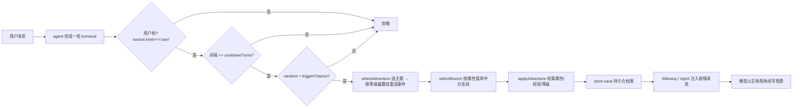
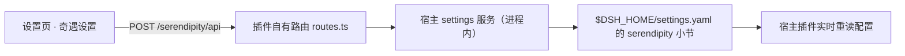

# dsh-serendipity（工作奇遇）开发指南

> 面向在本仓库工作的 AI agent / 开发者：本文档描述项目的架构、核心机制、
> 关键设计决策、构建测试流程与扩展守则。改动代码前请先读本文档，
> 尤其是「给 Agent 的守则」一节。

---

## 0. 项目一句话

一个 DeepSeek Harness（dsh）插件：把**用户本人当作 RPG 主角**，每次完成一轮
用户对话后有概率触发一次随机「奇遇」，奇遇来自 7 大主题（科幻/玄幻/远古/动漫/
小说/武侠/都市）的事件库，对六维属性（力量/智力/敏捷/魅力/幸运/体魄）产生
增减影响并积累经验升级；属性跨会话持久化，并反哺后续对话。同时向 dsh 设置页
注册「奇遇设置」页（浏览器端），可视化配置触发参数与主题开关。

- 包名：`@pocket30/dsh-serendipity`（v1.0.0，MIT）
- 宿主半（host）：监听 `turn/end`、结算养成、持久化、注册 `serendipity_*` 工具、挂载 `/serendipity/api` 路由
- 浏览器半（client）：注册 `settings.section` 设置页（角色档案 + 单选主题卡片网格）

---

## 1. 目录结构

```text
dsh-serendipity/
├── src/                     # 宿主半（Node，tsconfig.json 编译到 dist/）
│   ├── index.ts             #   插件入口：name/inject/apply + 汇总导出
│   ├── config.ts            #   schemastery schema + resolveCatalog 主题目录合并
│   ├── attributes.ts        #   六维属性目录（纯数据）
│   ├── themes.ts            #   主题定义汇总 + 事件层级（EVENT_TIERS）+ 分支定义（纯数据）
│   ├── themes-data/         #   7 个主题的批量事件数据（每主题约 100 个事件，纯数据）
│   │   ├── sci-fi.ts        #     科幻 · 60 日常 / 30 冒险 / 10 史诗 / 1 传奇
│   │   ├── xianxia.ts       #     玄幻 · 同上
│   │   ├── ancient.ts       #     远古 · 同上
│   │   ├── anime.ts         #     动漫 · 同上
│   │   ├── novel.ts         #     小说 · 同上
│   │   ├── wuxia.ts         #     武侠 · 同上
│   │   └── urban.ts         #     都市 · 同上
│   ├── engine.ts            #   抽奖/层级偏置权重/分支命中/结算/升级（纯函数，随机源可注入）
│   ├── profile.ts           #   角色档案 zod schema + createProfile
│   ├── store.ts             #   ProfileStore：storage domain + 内存降级
│   ├── settings.ts          #   设置命名空间注册（serendipity）+ 读写面
│   ├── routes.ts            #   /serendipity/api 路由 + 浏览器信任围栏
│   ├── runtime.ts           #   turn/end 监听、触发判定、剧情注入（AdventureRuntime）
│   ├── tools.ts             #   serendipity_status / serendipity_reset 工具定义
│   └── client/              # 浏览器半（tsconfig.client.json 类型检查 + tsdown 打包）
│       ├── index.ts         #   浏览器插件入口（slots.inject('settings.section')）
│       ├── api.ts           #   自有路由 fetch 封装（SerendipityApiError）
│       └── section.tsx      #   设置页组件（角色档案 + 乐观更新 + 修订号守卫）
├── tests/                   # vitest 单测（engine.spec.ts + runtime.spec.ts，共 34 个）
├── examples/                # 本地开发 overlay（--patch，仅宿主功能）
├── dist/                    # 宿主半构建产物（tsc 输出，gitignore）
├── lib/client.js            # 浏览器半 bundle（tsdown 输出，gitignore）
├── cordis.patch.yml         # bundle 层：把插件行插入组合配置
├── tsconfig.json            # 宿主半（NodeNext / strict / exactOptionalPropertyTypes）
├── tsconfig.client.json     # 浏览器半（DOM / react-jsx / noEmit 仅类型检查）
├── tsdown.config.ts         # 浏览器 bundle：__ModuleLoader__ 工厂包
└── vitest.config.ts         # 测试配置（tests/**/*.spec.ts，node 环境）
```

构建产物 `dist/`（宿主）与 `lib/client.js`（浏览器）均由 `npm run build` 生成，
已在 `.gitignore` 中，不要手改产物。

---

## 2. 核心事件流（触发链）



实现要点（`src/runtime.ts`）：

- **触发判定完全由会话日志推导**：`analyzeSession()` 扫描 `session.events`，
  `source.kind === 'user'` 的轮次记为用户轮；本插件注入轮次的
  `source.kind === 'plugin' && source.plugin === 'serendipity'` 记为奇遇标记。
  因此插件注入的剧情轮**不会**再触发奇遇（无无限套娃）。
- **冷却计数**：以「已完成的用户轮数」为序号，`completedUserTurns - lastAdventureUserTurnIndex >= cooldownTurns` 才可再触发。
- **只处理根会话**：`ctx.agents.roots().includes(agent)` 过滤，子代理会话不触发。
- **主题目录每次触发前实时解析**：`AdventureRuntime` 持有 `catalogSource: () => ThemeDef[]`
  （`index.ts` 传 `() => resolveCatalog(configSource())`），设置页的题材单选/权重/
  禁用修改即时生效——不要改成启动时静态快照（旧版 bug：设置页改了题材却不生效）。
- **等级偏置权重**：事件按 `minLevel` 分四档（日常/冒险/史诗/传奇，
  `EVENT_TIERS`）；未达门槛权重为 0，解锁后权重随等级线性放大
  （`eventSelectionWeight`，层级越高封顶倍数越大）——等级越高越容易遇到宏大事件。
- **属性分支线**：事件可选 `branches`（`EventBranch[]`），每条分支带 `when`
  条件（`min` / `max` / `highest` / `lowest` / `always`）。传 `random` 时采用
  **属性加权抽取**（`selectBranch` + `branchSelectionWeight`：分支权重 = 1 +
  属性值/10，`always` 恒为 1）——属性越高的分支越容易被选中，养成结果越来越
  明显地塑造后续剧情；不传 `random` 时保持确定性（按声明顺序取第一条命中，
  测试与旧行为兼容）。命中后分支的标题/描述/属性/经验取代事件本体结算，
  档案记录 `branch` 与 `tier` 字段。
- **防重复窗口**：`selectAdventure(profile, catalog, random, noRepeatWindow)`，
  排除最近 `noRepeatWindow`（默认 5，0 = 关闭）条奇遇记录（`adventureLog`
  的 `id`，格式 `主题名/事件id`）内出现过的同主题事件；整个主题都被窗口占满
  时回退到完整池，避免永远抽不到。
- **narrateMode**：`followup`（默认，agent.followup 让模型续写）| `inject`（仅注入上下文）| `none`（只记录不展示）。
- 每实例一份 `states` Map 缓存各会话的触发状态；`ctx.effect` 注册/清理监听，卸载时自动释放。

---

## 3. 设置链路（为什么有自有路由）



关键事实：**dsh Web 的设置 RPC 只把白名单命名空间（WEB_SETTINGS_NAMESPACES）
暴露给浏览器客户端**，第三方命名空间不会下发。因此「奇遇设置」页不走官方设置
RPC，而是：

1. 浏览器端 `src/client/api.ts` 用 `fetch('/serendipity/api/<method>')` POST 调用；
2. 宿主端 `src/routes.ts` 在 `webServer` 挂 `prefix: '/serendipity/api'` 路由，
   进程内调用 settings 服务读写 `serendipity` 命名空间；
3. 路由带与 `/api` 一致的**浏览器信任围栏**（`isTrustedApiRequest`）：
   - Host 头必须是环回主机名（localhost / 127.x / ::1）或在 `ctx.webRuntime.trustedHosts` 内；
   - `sec-fetch-site: cross-site` 直接拒绝；
   - 有 `origin` 头时必须与 Host 同源。
4. 四个方法：`settings.get`（配置 + 修订号）、`settings.update`（补丁 + 修订号守卫）、
   `settings.catalog`（主题目录，**始终返回全部主题**以便切换；单选模式 `theme`
   非空时 `enabled` 以它为准，否则看 `disabledThemes`）、
   `profile.get`（角色档案视图：等级/经验/六维属性/最近奇遇，设置页「角色档案」分组用；
   由 `index.ts` 经 `store.load` + `statusValue` 构建后注入路由）。

配置解析顺序：**schema 默认值 → 组合入口配置（cordis.yml config）→ 用户设置层
（settings.yaml `serendipity:` 小节）**。设置层覆盖入口配置，实时生效
（`scope.watch`）。

---

## 4. 持久化（storage domain + 内存降级）

`src/store.ts`：

- 声明 storage domain：`SERENDIPITY_DOMAIN`（name `serendipity`，version 1，
  一张 `profiles` 表，key = profileId，value 经 `CharacterProfileSchema` 校验）。
- `ProfileStore` 惰性打开 domain（`ctx.get('storageDomain')`）；未挂载或打开失败
  时**降级为进程内内存 Map** 并打一条告警（只告警一次）。
- `dsh web` 组合自带 storage；纯 headless/TUI 组合会降级——这是已知限制，不要
  试图在插件里强依赖 storage。
- 设置页「角色档案」通过 `profile.get` 路由读同一 store，UI 展示即持久化数据；
  `statusValue`（`src/tools.ts`）是工具、路由与设置页共用的档案视图构建函数。

---

## 5. 构建 / 测试 / 安装

```sh
npm run build    # ① tsc 宿主半 → dist/ ② tsc 浏览器半类型检查 ③ tsdown → lib/client.js
npm test         # vitest run（tests/**/*.spec.ts，node 环境）
npm run prepack  # 发布前自动 build
```

浏览器 bundle（`tsdown.config.ts`）关键点：

- 入口 `src/client/index.ts`，输出 `lib/client.js`，格式 `cjs`，banner/footer
  把它包成 `window.__ModuleLoader__.load({ id, factory })` 工厂包；
- **平台模块 external**：`react`、`@deepseek-ai/cordis`、`@deepseek-ai/dsh-client-*`
  等由浏览器 shell 的冻结模块表提供（`PLATFORM_MODULES` / `CLIENT_EXTERNALS`）；
  其余依赖内联（`noExternal` 兜底）。新增第三方浏览器依赖时注意它能否被内联。

安装方式（两种）：

```sh
# 方式一：npm 包 / tarball（含设置页卡片；推荐）
dsh plugin --profile web add ./pocket30-dsh-serendipity-1.0.0.tgz

# 方式二：开发模式 --patch（仅宿主逻辑 + /serendipity/api 路由，无设置页 UI）
npm run build
dsh --profile web --patch ./examples/web-overlay.cordis.yml
```

> `--patch` 的 file:// 入口只加载宿主逻辑；**设置页 UI 依赖 package 安装**
> （dsh 客户端模块系统只扫描可解析的包入口）。

---

## 6. 扩展指南

### 6.1 加主题 / 事件

- 内置目录：`src/themes.ts` 汇总 `DEFAULT_THEMES`，批量事件数据在
  `src/themes-data/`（每主题一个文件，导出 `<ID>_NEW_EVENTS`，由 `themes.ts`
  展开进对应主题）。事件字段：`id` / `title` / `description` / `effects`
  （属性 id → 增减值）/ `exp` / `minLevel?` / `weight` / `branches?`
  （属性分支线，`EventBranch[]`：`id` / `title` / `description` / `effects` /
  `exp?` / `when`）。层级由 `minLevel` 推导（`EVENT_TIERS`：
  日常 1 / 冒险 2 / 史诗 4 / 传奇 7），无需单独配置。
- 运行时可经配置追加：`extraThemes`（新主题）、`extraEvents`（向既有主题追加
  事件）、`themeWeights`（权重覆盖）、`disabledThemes`（禁用）——见
  `resolveCatalog()`（`src/config.ts`），顺序：内置 → 追加主题 → 追加事件 →
  权重覆盖 → 剔除禁用。
- 属性 id 必须来自 `DEFAULT_ATTRIBUTES`（`strength` / `intelligence` / `agility` /
  `charisma` / `luck` / `vitality`）；`tests/engine.spec.ts` 有完整性测试守护
  （每个主题至少一个事件、effects 属性 id 合法、每个主题都有史诗与传奇层级事件、
  分支的 effects 与条件属性 id 合法）。
- 单选主题：配置字段 `theme`（非空且存在时只从该主题抽事件，忽略
  `disabledThemes`；空字符串 = 按 `disabledThemes` 多选过滤）。设置页主题卡片是
  **单选**交互（点击写入 `theme`，旧配置在加载时自动归一），末尾预留
  「自定义题材」占位卡片（暂不可选）。单选后设置页**不再有主题权重入口**
  （`themeWeights` / `extraThemes.weight` 仍可在编排级配置中使用）。

### 6.2 加配置项

1. `src/config.ts` 的 `Config` interface + `Config` schema 增加字段（默认值给在 schema）；
2. 若需要设置页可见：`src/client/section.tsx` 的 `ConfigView.viewOf` 增加解析 + UI 行；
3. schema 字段会被设置页/入口配置覆盖，无需其他接线。

### 6.3 加设置路由方法

`src/routes.ts` 的 switch 加一个 case（方法名 `xxx` 即 URL `/serendipity/api/xxx`），
浏览器端在 `src/client/api.ts` 的 `api` 对象加对应封装。不要新增不受信任围栏保护的路径。

### 6.4 加模型工具

`src/tools.ts` 仿照 `buildStatusTool` / `buildResetTool`：
`defineTool({ name: 'serendipity_xxx', parameters, output: { schema, render }, execute })`，
在 `src/index.ts` 的 `apply` 里 `ctx.tools.register(...)`（受 `config.enableTools` 控制）。

---

## 7. 给 Agent 的守则

1. **不要改 DSH 官方源码 / 依赖包**：本仓库只产出独立插件；需要宿主能力时用
   现成的公开 API（agents / tools / settings / webServer / storageDomain），
   或插件自有路由。`node_modules.npm-backup/` 与 `node_modules/` 是依赖目录，
   一律不碰。
2. **纯函数与可测试性**：`engine.ts` / `attributes.ts` / `profile.ts` / `themes.ts`
   必须是纯函数/纯数据，随机源经 `EngineRandom` 注入——新增逻辑优先落在这里，
   单测才能注入确定性随机（参考 `tests/engine.spec.ts` 的 `sequence`）。
3. **随机源不要直接 `Math.random()`**：runtime 的 `random` 是构造参数
   （默认 `Math.random`）；新逻辑若需要随机，走同一注入通道。
4. **TypeScript 严格模式**：`strict` + `noUncheckedIndexedAccess` +
   `exactOptionalPropertyTypes`。注意：可选字段用 `...(cond ? { k: v } : {})`
   spread 而不是赋值 `undefined`；索引访问要处理 `undefined`。改完跑
   `npm run build` 验证两个 tsconfig 都通过。
5. **import 风格**：宿主半用 NodeNext 相对导入**带 `.js` 后缀**
   （如 `import { Config } from './config.js'`）；浏览器半 `src/client/` 里
   `allowImportingTsExtensions` 开了，可 `./api.ts` / `./section.tsx` 直引。
6. **client 代码纯度**：浏览器 bundle 的 external 清单固定；不要在 `src/client/`
   value-import 平台模块以外的宿主代码（宿主与浏览器是两个编译单元）。
7. **生命周期**：监听器 / 路由 / 工具注册一律走 `ctx.effect` 包裹（卸载自动
   清理，HMR-safe）；不要裸挂全局监听。
8. **触发判定不要手写新规则绕过会话日志推导**：`analyzeSession` 是「不自我触发」
   的根基，改动它必须同步更新 `tests/runtime.spec.ts` 的用例。
9. **已知限制要尊重**：无 storage 组合降级内存（重启丢档）、`narrateMode: none`
   时冷却标记只在内存、设置页 UI 依赖 package 安装——这些是设计取舍，不是 bug。
10. **文档同步**：改行为契约（触发规则、设置链路、信任围栏、bundle external、
    配置 schema）时同步更新本文件与 `README.md` 相应小节。

---

## 8. 版本与依赖

- 依赖 `@deepseek-ai/*` 的 **0.1.0-rc.6** 家族（peer：dsh-llm / dsh-settings /
  dsh-storage-domain / dsh-tools / schemastery；dev：cordis / dsh-agent /
  dsh-session / dsh-storage / dsh-host-webserver / dsh-client-*），与 dsh CLI
  0.1.0-rc.6 对齐。宿主版本差异过大时需同步升级依赖并重新构建。
- 运行时唯一硬依赖：`zod`（档案 schema 校验）。
- 发包：`npm publish --access public`（scope `@pocket30` 私有，需先公开 scope）；
  `prepack` 自动构建，tarball 含 `dist/` + `lib/client.js` + `cordis.patch.yml`。

### 发版后流程（每次更新版本号后必须完整执行）

1. **上传 npm**：`npm publish --access public`（`prepack` 自动构建，产物含
   `dist/` + `lib/client.js` + `cordis.patch.yml`）；
2. **本地 profile 拉取最新版本**：`dsh plugin --profile web add "@pocket30/dsh-serendipity@<新版本号>"`
   （`dsh plugin` 是 pnpm 转发器：在 `$DSH_HOME/profiles/web` 下执行 `pnpm add`，
   更新依赖范围并自动协调 `dsh.profile.bundles` 层）。**必须带显式版本号**：
   实测无版本号的 `add` 在已有 `^0.x` 范围时只会报 "Already up to date"，
   不会跨 minor 拉新版；`update` 同理；
3. **重启 dsh web**：杀掉监听 3080 的进程（`node ...\dsh\lib\bin.js web`），
   重新 `dsh web` 启动，浏览器硬刷新。宿主逻辑与设置页 UI 都重新加载。

> 验证安装版本：`Get-Content "$env:USERPROFILE\.dsh\profiles\web\node_modules\@pocket30\dsh-serendipity\package.json"` 的 `version` 字段。
